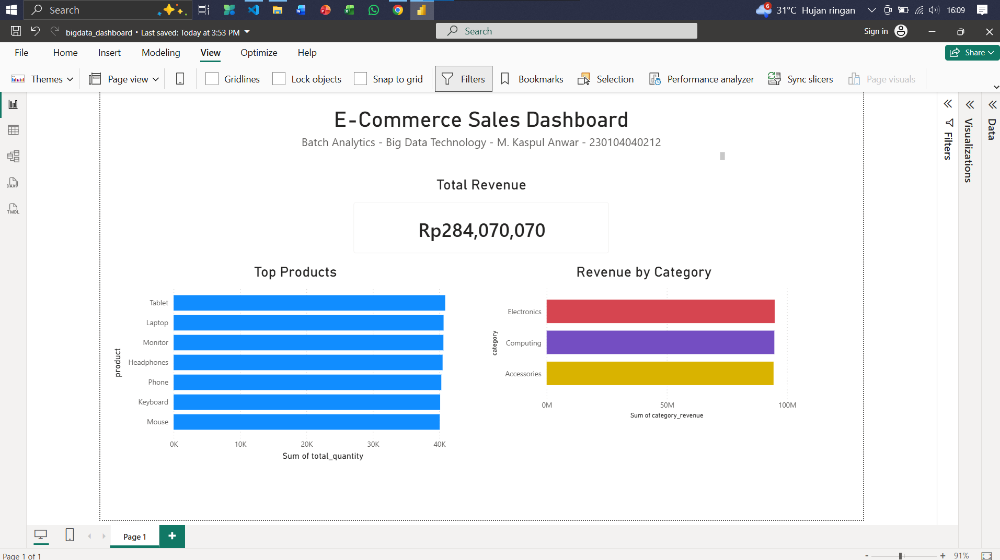
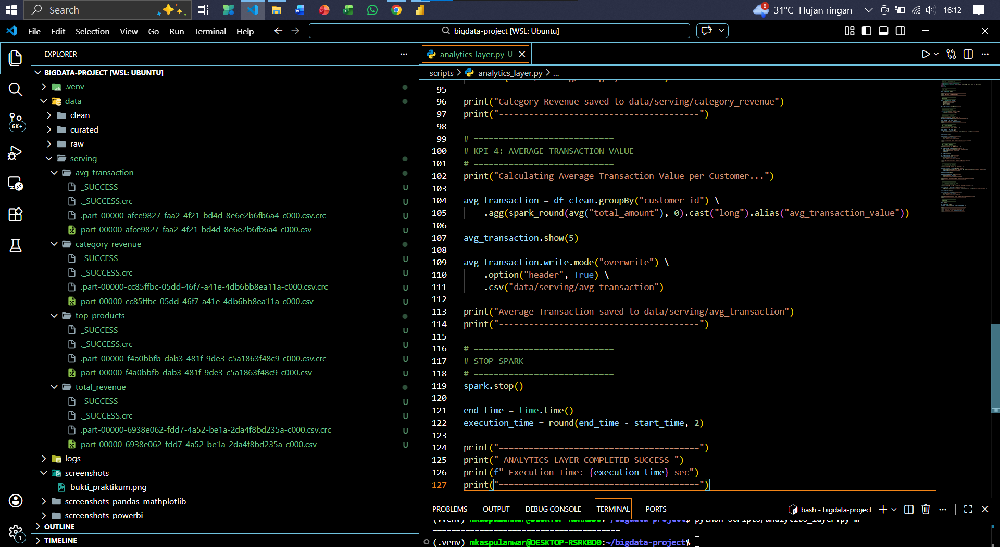
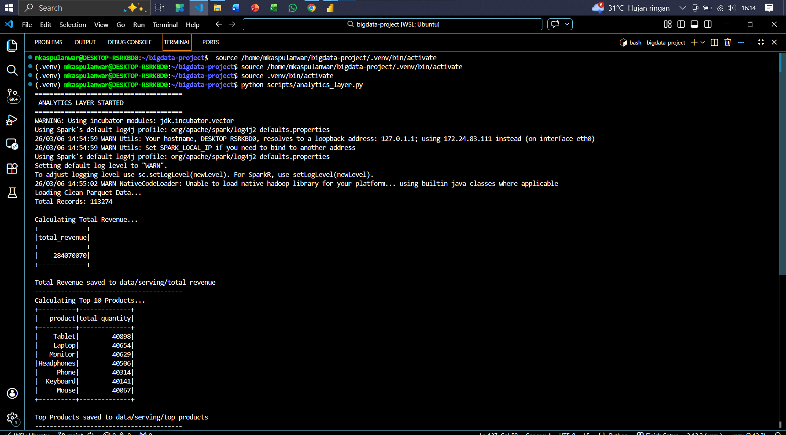
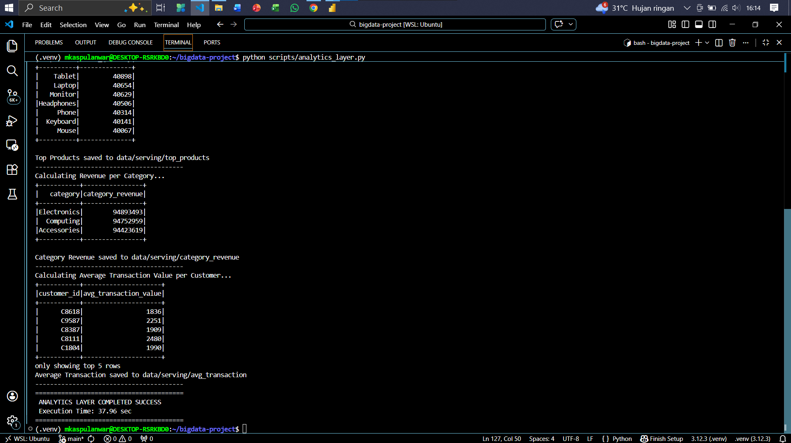

# PRAKTIKUM 3 BATCH DATA ANALYTICS & VISUALIZATION LAYER
<p align="center">
  
</p>

## Deskripsi
Repository ini berisi hasil Praktikum Week 3 mata kuliah **Teknologi Big Data** yang berfokus pada pembangunan **Analytics Layer** dan **Visualization Layer** dari pipeline data e-commerce. Pada praktikum ini, data hasil pemrosesan Spark dari tahap sebelumnya dilanjutkan ke proses agregasi metrik bisnis seperti **total revenue**, **top products**, **revenue per category**, dan **average transaction value per customer**, kemudian divisualisasikan dalam bentuk dashboard menggunakan **Microsoft Power BI**. Praktikum ini menunjukkan alur end-to-end mulai dari **clean data (Parquet)** hingga menjadi **insight bisnis** yang siap digunakan untuk pengambilan keputusan.

## Tim Developer

| Peran | Nama | NIM | Profil GitHub |
| :--- | :--- | :--- | :--- |
| **Pengembang Proyek** | M. Kaspul Anwar | 230104040212 | [](https://github.com/mkaspulanwar) |
| **Dosen Pengampu** | Muhayat, M. IT | - | [](https://github.com/muhayat-lab) |

---

## Tujuan Praktikum

Praktikum ini bertujuan untuk:

- Memahami peran **Visualization Layer** dalam arsitektur Big Data
- Menggunakan **Power BI** untuk membuat dashboard analitik
- Menghubungkan dataset hasil pipeline **Spark** ke tools **Business Intelligence**
- Membuat **KPI dashboard** sederhana dari dataset e-commerce
- Menyajikan insight bisnis dari data yang telah diproses

---

## Konteks Praktikum

Dalam arsitektur Big Data modern, alur pipeline data umumnya terdiri dari beberapa layer:

- **Data Source** → sumber data mentah
- **Processing Layer** → pemrosesan data dengan Spark
- **Storage Layer** → penyimpanan data, misalnya dalam format Parquet
- **Analytics Layer** → agregasi dan perhitungan KPI
- **Visualization Layer** → dashboard untuk analisis dan pengambilan keputusan

Pada praktikum ini, fokus utama ada pada dua layer terakhir, yaitu **Analytics Layer** dan **Visualization Layer**.

---

## Bukti Screenshots

Berikut dokumentasi proses praktikum 2 batch data ingestion & processing with spark:

<table>
<tr>
<td align="center"><b>Dashboard Power BI</b></td>
<td align="center"><b>Folder Serving Dataset</b></td>
</tr>
<tr>
<td></td>
<td></td>
</tr>

<tr>
<td align="center"><b>Script Analytics Layer</b></td>
<td align="center"><b>Script Analytics Layer</b></td>
</tr>
<tr>
<td></td>
<td></td>
</tr>
</table>

---

## Struktur Folder Project
Struktur folder mengikuti standar data lake berlapis agar alur kerja jelas dan mudah dikembangkan.
```markdown
bigdata-project/
├── data/
│   ├── raw/
│   ├── clean/
│   │   ├── parquet/
│   │   └── partitioned_by_category/
│   ├── curated/
│   │   ├── avg_transaction/
│   │   ├── category_revenue/
│   │   └── top_products/
│   └── serving/
│       ├── total_revenue/
│       ├── top_products/
│       ├── category_revenue/
│       └── avg_transaction/
├── logs/
├── screenshots/
├── screenshots_powerbi/
├── scripts/
│   ├── analytics_layer.py
│   └── visualization_layer.py
├── .gitignore
├── CONTRIBUTING.md
├── LICENSE
└── README.md
```

