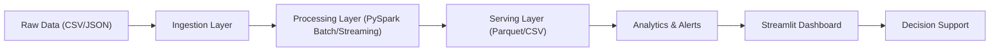
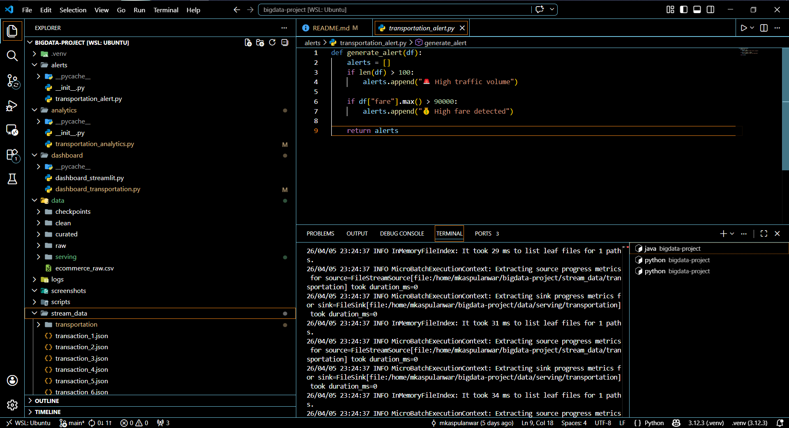
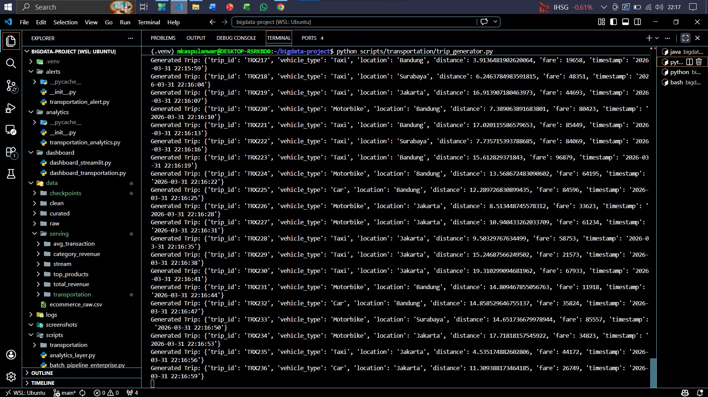
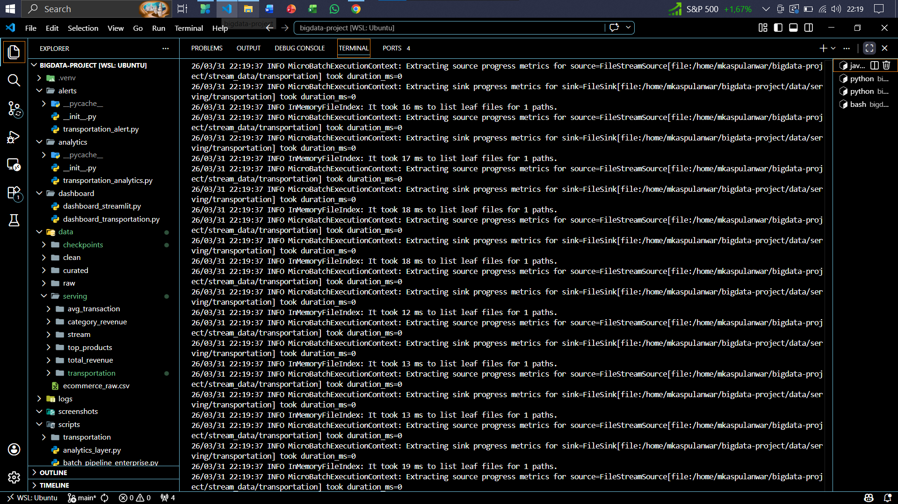
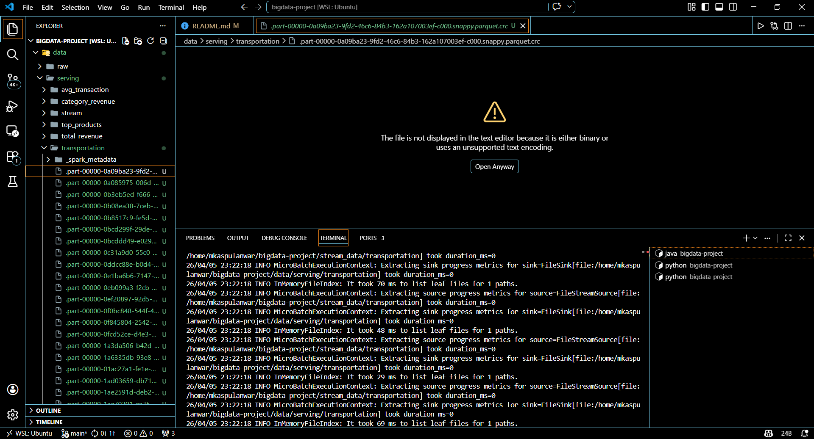
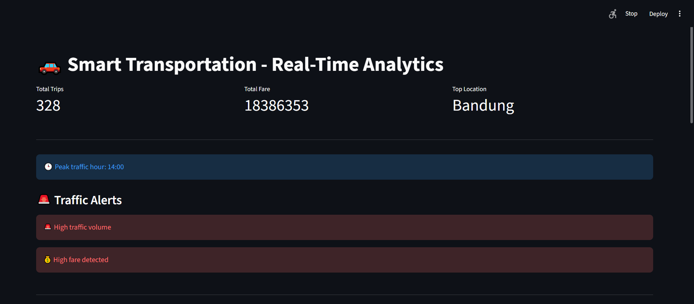
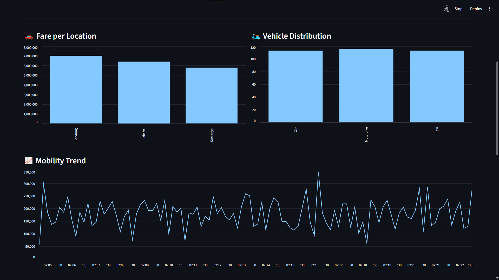
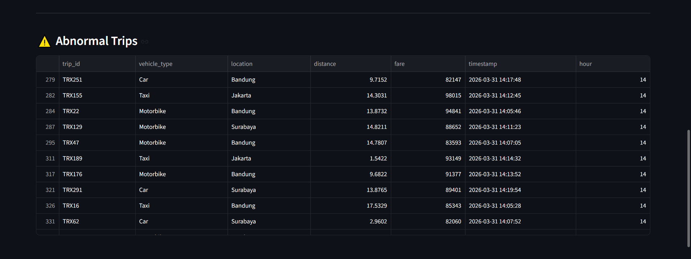
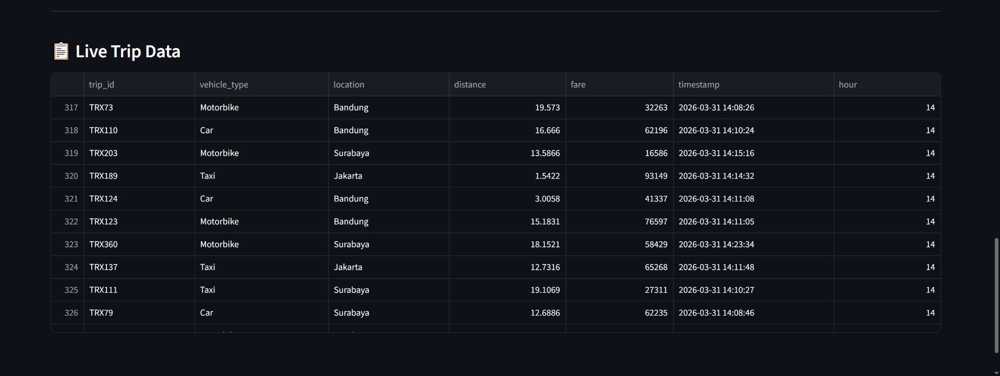

# Praktikum Week 5 : Big Data Analytics & Use Case (Decision-Oriented System)


## Tim Developer

| Peran | Nama | NIM | Profil GitHub |
| :--- | :--- | :--- | :--- |
| **Pengembang Proyek** | M. Kaspul Anwar | 230104040212 | [](https://github.com/mkaspulanwar) |
| **Dosen Pengampu** | Muhayat, M. IT | - | [](https://github.com/muhayat-lab) |

---

## Tentang Praktikum
Praktikum ini membangun **Decision-Oriented Big Data System** yang menggabungkan:
- **Batch pipeline** untuk pemrosesan data historis e-commerce.
- **Streaming pipeline** untuk data real-time.
- **Analytics + serving layer** untuk menghasilkan KPI bisnis.
- **Dashboard interaktif** untuk monitoring dan pengambilan keputusan.

Implementasi di project ini mencakup 2 use case:
1. **E-Commerce Analytics** (batch + streaming + dashboard KPI).
2. **Smart Transportation Analytics** (streaming trip, alert, dan dashboard real-time).

## Tujuan Praktikum
Tujuan utama praktikum Week 5 ini:
- Memahami alur **end-to-end data pipeline** dari raw data hingga visualisasi.
- Menerapkan konsep **decision-oriented system** berbasis KPI dan alert.
- Menggunakan **Apache Spark (PySpark)** untuk batch dan structured streaming.
- Menyajikan insight operasional melalui **dashboard Streamlit**.

## Arsitektur Singkat


## Struktur Project
```bash
bigdata-project/
├── .venv/                                 # Virtual environment lokal
├── alerts/                                # Modul alert untuk use case transportation
│   ├── __init__.py
│   └── transportation_alert.py            # Rule-based alert (traffic/fare)
├── analytics/                             # Modul analytics untuk transportation
│   ├── __init__.py
│   └── transportation_analytics.py        # KPI, trend, anomaly detection
├── dashboard/                             # Aplikasi dashboard Streamlit
│   ├── dashboard_streamlit.py             # Dashboard real-time e-commerce
│   └── dashboard_transportation.py        # Dashboard decision-oriented transportation
├── data/
│   ├── checkpoints/                       # Spark streaming checkpoint
│   │   └── transportation/
│   ├── clean/                             # Data hasil cleaning (parquet/partitioned)
│   ├── curated/                           # Data agregasi bisnis
│   ├── raw/
│   │   └── ecommerce_raw.csv              # Dataset mentah utama batch
│   └── serving/                           # Data siap konsumsi dashboard
│       ├── avg_transaction/
│       ├── category_revenue/
│       ├── stream/                        # Output streaming e-commerce
│       ├── top_products/
│       ├── total_revenue/
│       └── transportation/                # Output streaming transportation
├── logs/
│   ├── batch_pipeline.log                 # Log proses batch pipeline
│   └── stream_checkpoint/                 # Checkpoint streaming e-commerce
├── screenshots/                           # Screenshot dokumentasi hasil praktikum
├── scripts/                               # Pipeline utama praktikum
│   ├── analytics_layer.py                 # Analytics + serving layer (e-commerce)
│   ├── batch_pipeline_enterprise.py       # Batch processing pipeline
│   ├── streaming_layer.py                 # Streaming ingestion e-commerce
│   ├── transaction_generator.py           # Generator transaksi e-commerce
│   └── transportation/
│       ├── streaming_trip_layer.py       # Streaming ingestion transportation
│       └── trip_generator.py              # Generator trip transportation
├── stream_data/                           # Input simulasi data streaming
│   └── transportation/
├── .gitignore
├── CONTRIBUTING.md
├── LICENSE
└── README.md
```
## Bukti Screenshots

<table>
<tr>
<td align="center"><b>Struktur Project</b></td>
<td align="center"><b>Generator Transaksi</b></td>
</tr>
<tr>
<td></td>
<td></td>
</tr>

<tr>
<td align="center"><b>Spark Streaming</b></td>
<td align="center"><b>Folder data/serving</b></td>
</tr>
<tr>
<td></td>
<td></td>
</tr>

<tr>
<td align="center"><b>Dashboard Realtime 1</b></td>
<td align="center"><b>Dashboard Realtime 2</b></td>
</tr>
<tr>
<td></td>
<td></td>
</tr>

<tr>
<td align="center"><b>Dashboard Realtime 3</b></td>
<td align="center"><b>Dashboard Realtime 4</b></td>
</tr>
<tr>
<td></td>
<td></td>
</tr>
</table>

---

## Setup Environment
### 1) Prasyarat
- Python 3.10+ (disarankan 3.12)
- Java 8/11+ (dibutuhkan Spark)
- `pip` dan virtual environment

### 2) Buat dan aktifkan virtual environment
```bash
python -m venv .venv
source .venv/bin/activate
```

Untuk PowerShell:
```powershell
python -m venv .venv
.venv\Scripts\Activate.ps1
```

### 3) Install dependency
```bash
pip install pyspark streamlit pandas pyarrow
```

## Cara Menjalankan
Gunakan beberapa terminal terpisah untuk komponen streaming.

### A. Use Case 1: E-Commerce (Batch + Streaming)
1. Jalankan batch pipeline (raw -> clean/curated):
```bash
python scripts/batch_pipeline_enterprise.py
```
2. Jalankan analytics layer (serving KPI):
```bash
python scripts/analytics_layer.py
```
3. Jalankan generator data transaksi real-time:
```bash
python scripts/transaction_generator.py
```
4. Jalankan Spark streaming consumer:
```bash
python scripts/streaming_layer.py
```
5. Jalankan dashboard e-commerce:
```bash
streamlit run dashboard/dashboard_streamlit.py
```

### B. Use Case 2: Smart Transportation (Decision-Oriented)
1. Jalankan generator trip:
```bash
python scripts/transportation/trip_generator.py
```
2. Jalankan streaming trip layer:
```bash
python scripts/transportation/streaming_trip_layer.py
```
3. Jalankan dashboard transportation:
```bash
streamlit run dashboard/dashboard_transportation.py
```

## Output yang Dihasilkan
- **Batch Output**
  - `data/clean/parquet/`
  - `data/curated/category_revenue/`
  - `data/curated/top_products/`
  - `data/curated/avg_transaction/`
- **Serving Layer**
  - `data/serving/total_revenue`
  - `data/serving/top_products`
  - `data/serving/category_revenue`
  - `data/serving/avg_transaction`
  - `data/serving/stream`
  - `data/serving/transportation`
- **Log**
  - `logs/batch_pipeline.log`

## Konteks Decision-Oriented System
Sistem ini dirancang untuk mendukung keputusan cepat berbasis data:
- KPI membantu melihat performa bisnis/operasional secara real-time.
- Alert membantu mendeteksi kondisi kritis (misalnya lonjakan trafik/fare tinggi).
- Dashboard menjadi antarmuka keputusan untuk tim operasional/manajemen.

## Troubleshooting Singkat
- Jika Spark gagal start, cek Java:
```bash
java -version
```
- Jika dashboard kosong, pastikan job generator dan streaming sudah berjalan.
- Jika pembacaan parquet bermasalah, pastikan `pyarrow` sudah terinstall.

---
Praktikum ini menunjukkan implementasi Big Data Analytics yang tidak hanya melakukan pemrosesan data, tetapi juga menghadirkan insight operasional untuk pengambilan keputusan (decision-oriented).


