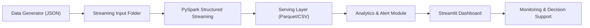

# Praktikum Big Data Week 6: Real-Time Analytics & Visualisasi Data Skala Besar


## Tim Praktikum

| Peran | Nama | NIM | Profil GitHub |
| :--- | :--- | :--- | :--- |
| **Pengembang Proyek** | M. Kaspul Anwar | 230104040212 | [](https://github.com/mkaspulanwar) |
| **Dosen Pengampu** | Muhayat, M. IT | - | [](https://github.com/muhayat-lab) |

---

## Deskripsi Project

Project Week 6 ini berfokus pada implementasi **Real-Time Analytics** dan **Visualisasi Data Skala Besar** dengan pendekatan end-to-end:

1. Data transaksi/trip disimulasikan secara streaming dalam format JSON.
2. Data streaming diproses menggunakan **PySpark Structured Streaming**.
3. Hasil stream disimpan ke **serving layer** berbasis Parquet.
4. Dashboard **Streamlit** menampilkan KPI, trend, distribusi, window aggregation, dan anomaly detection secara near real-time.

Implementasi mencakup dua use case:

1. **Real-Time E-Commerce Analytics**.
2. **Smart Transportation Analytics** (termasuk alert & anomali).

## Tujuan Praktikum

Tujuan utama praktikum Week 6:

1. Memahami alur real-time pipeline dari data generator ke dashboard.
2. Menerapkan **Structured Streaming** untuk pemrosesan data kontinu.
3. Menerapkan strategi visualisasi skala besar (sampling dan window aggregation).
4. Menyajikan metrik operasional real-time sebagai dasar pengambilan keputusan.
5. Mengintegrasikan analitik, alert, dan monitoring dalam satu sistem.

## Capaian Teknis Week 6

Fitur yang ditekankan pada minggu ini:

1. Streaming ingestion data real-time (e-commerce dan transportation).
2. Window aggregation untuk traffic visualization per interval waktu.
3. Downsampling/subset data untuk visualisasi yang lebih ringan.
4. Rule-based alert (high traffic dan high fare).
5. Deteksi anomali trip berdasarkan fare threshold.

## Arsitektur Sistem



## Struktur Project

```bash
bigdata-project/
|-- alerts/
|   |-- __init__.py
|   `-- transportation_alert.py
|-- analytics/
|   |-- __init__.py
|   `-- transportation_analytics.py
|-- dashboard/
|   |-- dashboard_streamlit.py
|   `-- dashboard_transportation.py
|-- data/
|   |-- raw/
|   |   `-- ecommerce_raw.csv
|   |-- clean/
|   |-- curated/
|   |-- serving/
|   |   |-- stream/
|   |   |-- transportation/
|   |   |-- total_revenue/
|   |   |-- top_products/
|   |   |-- category_revenue/
|   |   `-- avg_transaction/
|   |-- checkpoints/
|   |   `-- transportation/
|   `-- ecommerce_raw.csv
|-- logs/
|   |-- batch_pipeline.log
|   `-- stream_checkpoint/
|-- screenshots/
|-- scripts/
|   |-- batch_pipeline_enterprise.py
|   |-- analytics_layer.py
|   |-- transaction_generator.py
|   |-- streaming_layer.py
|   `-- transportation/
|       |-- trip_generator.py
|       `-- streaming_trip_layer.py
|-- stream_data/
|   `-- transportation/
|-- .gitignore
|-- CONTRIBUTING.md
|-- LICENSE
`-- README.md
```
## Penjelasan Komponen Utama

1. **Generator Layer**
   - `scripts/transaction_generator.py`: membuat transaksi e-commerce JSON secara kontinu.
   - `scripts/transportation/trip_generator.py`: membuat data trip transportation JSON.
2. **Streaming Processing Layer**
   - `scripts/streaming_layer.py`: membaca `stream_data/` lalu menulis ke `data/serving/stream`.
   - `scripts/transportation/streaming_trip_layer.py`: membaca `stream_data/transportation` lalu menulis ke `data/serving/transportation`.
3. **Analytics & Alert Layer**
   - `analytics/transportation_analytics.py`: metrik, trend, window aggregation, anomaly detection.
   - `alerts/transportation_alert.py`: rule-based alert untuk kondisi trafik/fare.
4. **Visualization Layer**
   - `dashboard/dashboard_streamlit.py`: dashboard real-time e-commerce.
   - `dashboard/dashboard_transportation.py`: dashboard transportation dengan fitur Week 6.

## Bukti Screenshots

| No | Bukti | File Screenshot |
| :-- | :-- | :-- |
| 1 |  |  |
| 2 |  |  |
| 3 |  |  |
| 4 |  |  |
| 5 |  |  |
| 6 |  |  |
| 7 |  |  |
| 8 |  |  |

---

## Setup Environment

### 1) Prasyarat

1. Python 3.10+ (direkomendasikan 3.12).
2. Java 8/11+ (dibutuhkan Spark).
3. `pip` dan virtual environment.

### 2) Membuat Virtual Environment

Untuk Linux/macOS:

```bash
python -m venv .venv
source .venv/bin/activate
```

Untuk PowerShell:

```powershell
python -m venv .venv
.venv\Scripts\Activate.ps1
```

### 3) Install Dependency

```bash
pip install pyspark streamlit pandas pyarrow
```

## Cara Menjalankan Project

Gunakan beberapa terminal secara paralel untuk simulasi real-time.

### A. E-Commerce Pipeline (Batch + Real-Time)

1. Jalankan batch pipeline:

```bash
python scripts/batch_pipeline_enterprise.py
```

2. Jalankan analytics layer untuk serving KPI:

```bash
python scripts/analytics_layer.py
```

3. Jalankan generator transaksi real-time:

```bash
python scripts/transaction_generator.py
```

4. Jalankan Spark streaming consumer:

```bash
python scripts/streaming_layer.py
```

5. Jalankan dashboard e-commerce:

```bash
streamlit run dashboard/dashboard_streamlit.py
```

### B. Smart Transportation Pipeline (Real-Time + Visualisasi Skala Besar)

1. Jalankan generator trip:

```bash
python scripts/transportation/trip_generator.py
```

2. Jalankan streaming trip layer:

```bash
python scripts/transportation/streaming_trip_layer.py
```

3. Jalankan dashboard transportation:

```bash
streamlit run dashboard/dashboard_transportation.py
```

## Output yang Dihasilkan

1. **Batch Layer**
   - `data/clean/parquet/`
   - `data/clean/partitioned_by_category/`
   - `data/curated/category_revenue/`
   - `data/curated/top_products/`
   - `data/curated/avg_transaction/`
2. **Serving Layer**
   - `data/serving/total_revenue/`
   - `data/serving/top_products/`
   - `data/serving/category_revenue/`
   - `data/serving/avg_transaction/`
   - `data/serving/stream/`
   - `data/serving/transportation/`
3. **Checkpoint dan Log**
   - `logs/stream_checkpoint/`
   - `data/checkpoints/transportation/`
   - `logs/batch_pipeline.log`

## Validasi Hasil Praktikum

Indikator bahwa pipeline berjalan dengan benar:

1. File JSON baru terus muncul di folder `stream_data/` dan `stream_data/transportation/`.
2. File parquet baru muncul di `data/serving/stream/` dan `data/serving/transportation/`.
3. Dashboard menampilkan metrik yang terus berubah setiap refresh interval.
4. Alert muncul saat volume tinggi atau fare melewati threshold.
5. Tabel anomali menampilkan trip abnormal (fare tinggi) jika ada.

## Troubleshooting

1. Jika Spark gagal start, cek Java:

```bash
java -version
```

2. Jika dashboard kosong:
   - pastikan generator dan streaming job sudah berjalan,
   - pastikan folder output serving sudah terisi.
3. Jika parquet gagal dibaca di dashboard:
   - pastikan `pyarrow` sudah terinstall.
4. Jika terjadi konflik data lama:
   - hentikan semua proses stream,
   - bersihkan folder output tertentu yang ingin diulang (opsional),
   - jalankan ulang pipeline dari awal.

## Penutup

Praktikum Week 6 ini menunjukkan implementasi sistem **real-time analytics** yang tidak hanya memproses data streaming, tetapi juga menyajikan visualisasi yang lebih siap skala besar melalui window aggregation, sampling data, dan monitoring berbasis dashboard interaktif.

